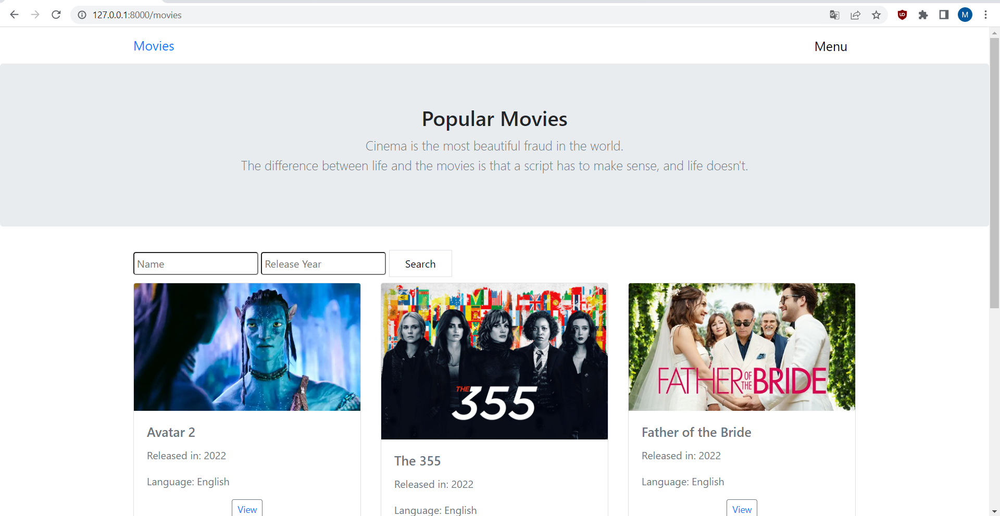
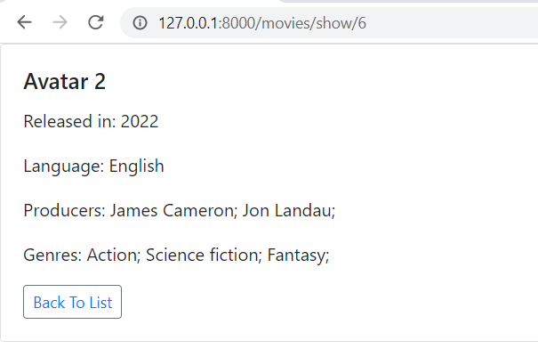

# Movie-Laravel-Project
## Система за филми

Системата служи за съхраняване на данни за филми (име, година на излизане, продуцент, жанр, език).

Админ панел:
Състои се от User, Genre, Movie, Producer.

На страница Movies има списък с всички филми, търсачка.

Страница Show съдържа подробна информация за съответния филм.

